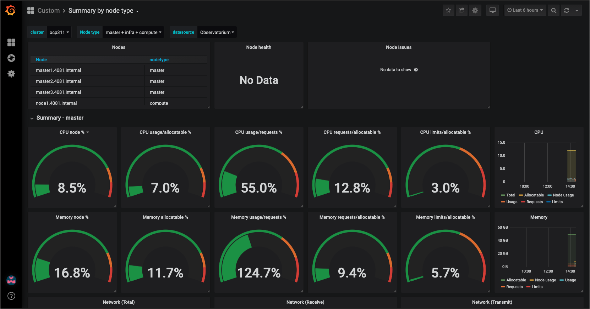
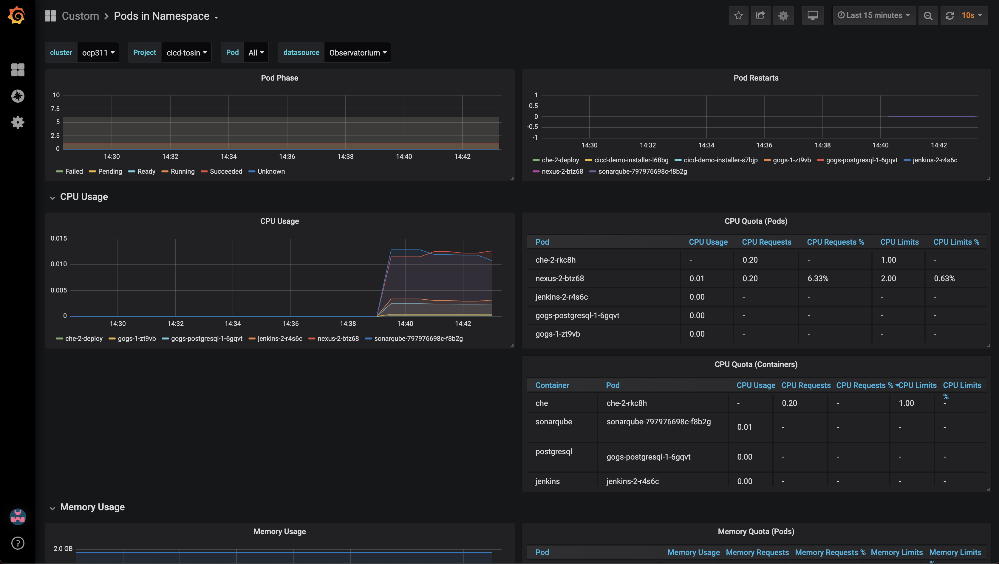
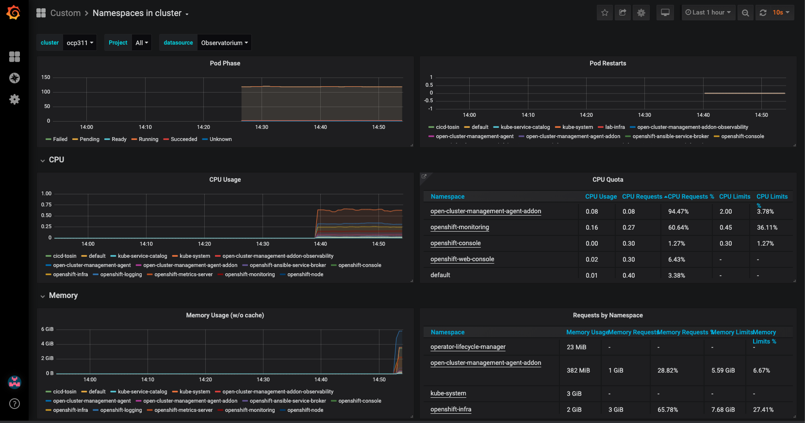
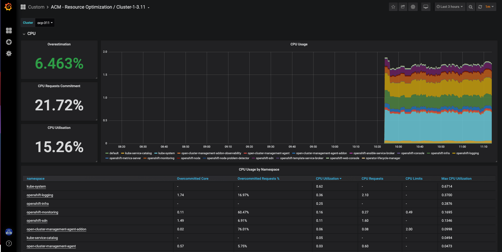
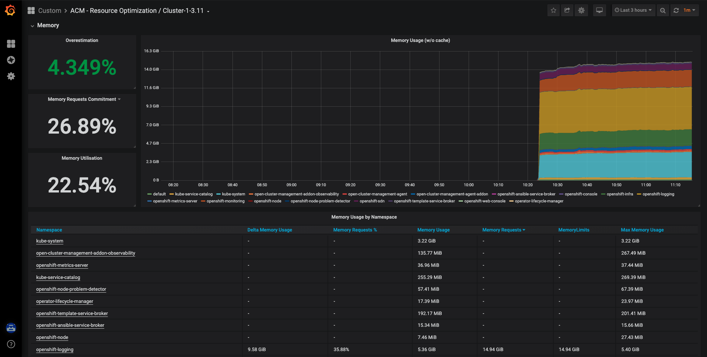

# Custom Dashboards for ACM Observability

## Requirements
* [OpenShift](https://www.openshift.com/)
* [Red Hat Advanced Cluster Management for Kubernetes](https://access.redhat.com/documentation/en-us/red_hat_advanced_cluster_management_for_kubernetes/2.4)
*  [Observability service](https://access.redhat.com/documentation/en-us/red_hat_advanced_cluster_management_for_kubernetes/2.4/html/observability/observing-environments-intro#enable-observability)
* [Requirements for OpenShift 3.11 Clusters](requirements-for-openshift-3.11.md)

## Getting started 
**Once ACM is installed run the following commands to install the Observability service**  
* [Install ACM observability Service](install-acm-observability-service.md)

**Install the Grafana dev environment on cluster**
* [How to design a grafana dashboard](https://github.com/open-cluster-management/multicluster-observability-operator/tree/main/tools)

**Once the e Grafana dev enviornment is installed you can run the below command to access the UI** 
```
echo https://multicloud-console.$(oc get ingresses.config.openshift.io cluster -o jsonpath='{ .spec.domain }')/grafana-dev/
```

**Design your grafana dashboard**  
* [Design your grafana dashboard](https://github.com/open-cluster-management/multicluster-observability-operator/tree/main/tools)

## Clone Repo
```

git clone https://github.com/tosin2013/acm-multi-cluster-dashboard.git
```

## login to ACM cluster via oc command line

## Custom Dashboard Examples
The dashboards below are custom dashboards that display OpenShift 3.11 clusters within an environment. 

> In order for the dashboards to work you must create a observability-metrics-custom-allowlist on your RHACM cluster


**Create observability-metrics-custom-allowlist.yaml**
```
cat >observability-metrics-custom-allowlist.yaml<<YAML
kind: ConfigMap
apiVersion: v1
metadata:
  name: observability-metrics-custom-allowlist
data:
  metrics_list.yaml: |
    names:
      - node:node_cpu_utilisation:avg1m
      - kube_node_labels
      - 'node_namespace_pod:kube_pod_info:'
      - container_memory_usage_bytes
      - node_memory_MemTotal_bytes
      - node_memory_MemAvailable_bytes
      - node:node_memory_bytes_total:sum
      - node:node_net_utilisation:sum_irate
      - node_network_receive_bytes
      - node_network_transmit_bytes
      - node_disk_bytes_read
      - node_disk_bytes_written
      - node:node_disk_utilisation:avg_irate
      - kube_pod_status_ready
      - kube_pod_status_phase
      - node_filesystem_size
      - node_filesystem_avail
      - kube_pod_container_status_restarts_total
      - openshift_clusterresourcequota_usage
      - openshift_clusterresourcequota_labels
      - namespace_pod_name_container_name:container_cpu_usage_seconds_total:sum_rate
      - kube_namespace_labels
      - container_memory_rss
      - kube_namespace_labels
      - kube_pod_info
      - container_cpu_usage_seconds_total
      - kube_node_status_allocatable_cpu_cores
YAML
```
**Apply config map against RHACM**
```
oc apply -n open-cluster-management-observability -f observability-metrics-custom-allowlist.yaml
```

## Dashboard List 
> All the command beow need to be ran against the RHACM cluster in order to be shown on the grafana dashboard. 

### Load all dashboards
```
oc create -f config-files/
```

### Summary By Node 


Create Summary By Node 
```
oc create -f config-files/summary-by-node.yaml
```

### Pods in namespace


Create Pods in namespace
```
oc create -f config-files/pods-in-namespace.yaml
```

### Namespaces in cluster 


Namespaces in cluster
```
oc create -f config-files/namespaces-in-cluster.yaml
```

### ACM - Resource Optimization / Cluster-1-3.11



Create ACM - Resource Optimization / Cluster-1-3.11 dashboard
```
oc create -f config-files/config-files/acm-resource-optimization-cluster-1-3-11.yaml
```

### Kubernetes / Compute Resources / Namespace (Pods) - 3.11 


Create Kubernetes / Compute Resources / Namespace (Pods) - 3.11 dashboard)
```
oc create -f config-files/kubernetes-compute-resources-namespace-pods-3-11.yaml
```
### Kubernetes / Compute Resources / Pod - 3.11


Kubernetes / Compute Resources / Pod - 3.11
```
oc create -f config-files/compute-resources-pod-3.11.yaml
```

###  Capacity Planning 3.11 


Capacity Planning 3.11 
```
oc create -f config-files/capacity-planning-3.11.yaml
```

###  ACM - Clusters Overview - OCP 3.11


ACM - Clusters Overview - OCP 3.11
```
oc create -f config-files/acm-cluster-overview-ocp3.11.yaml
```

## Links: 
* https://github.com/bszeti/openshift-grafana-dashboards
* https://github.com/redhat-cop/openshift-toolkit/tree/master/capacity-dashboard
* [OBSERVING ENVIRONMENTS](https://access.redhat.com/documentation/en-us/red_hat_advanced_cluster_management_for_kubernetes/2.2/html-single/observing_environments/index)
* https://iximiuz.com/en/posts/prometheus-vector-matching/
